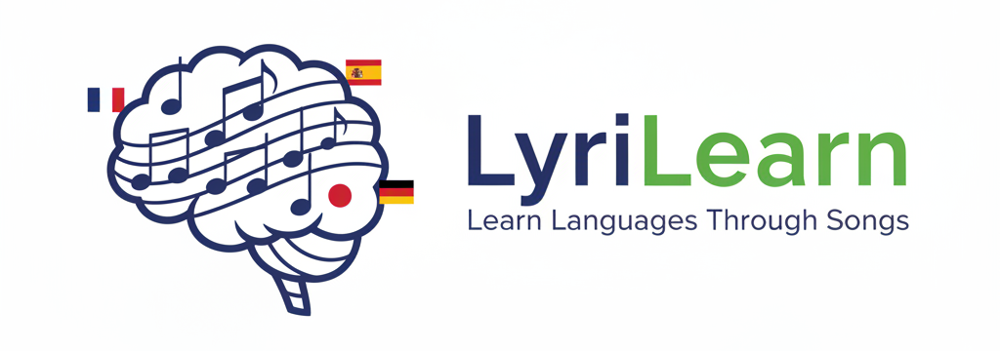
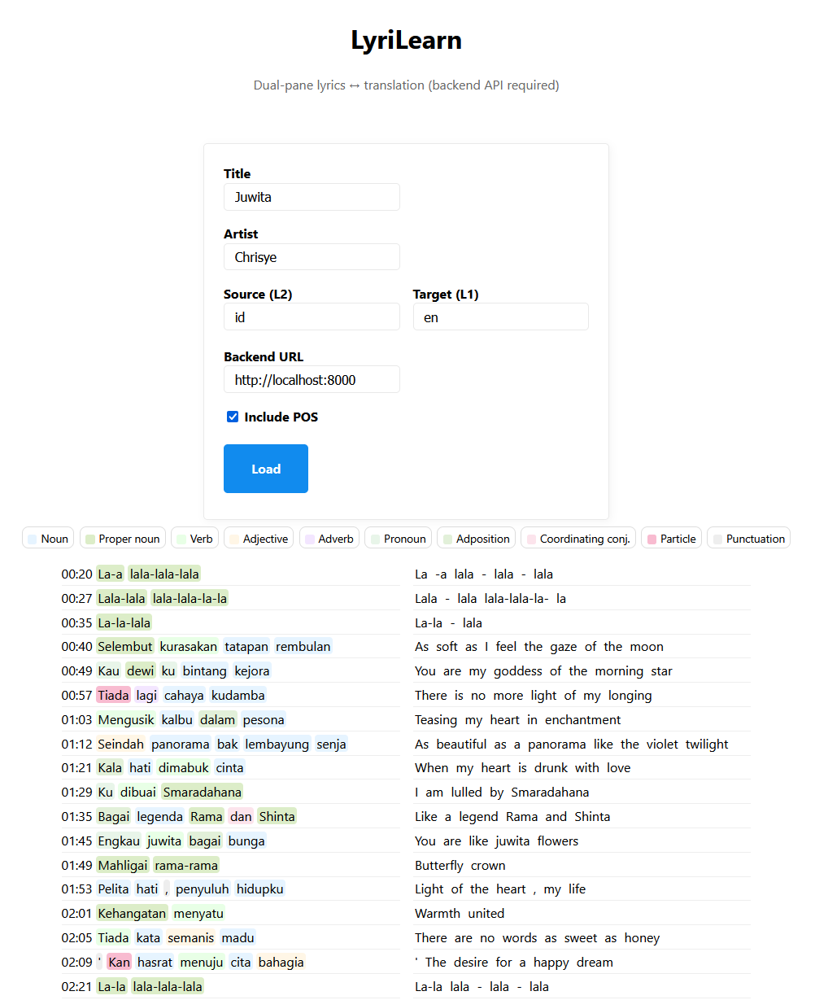

# LyriLearn

<!-- Add a banner here like: https://github.com/StephanAkkerman/fintwit-bot/blob/main/img/logo/fintwit-banner.png -->

---
<!-- Adjust the link of the first and second badges to your own repo -->
<p align="center">
  
  
  <a href="https://github.com/psf/black"></a>
</p>

## Introduction

If you listen to music from different countries, you might find it challenging to understand the lyrics in foreign languages. LyriLearn is a Python application that helps you learn foreign languages through song lyrics. It fetches synchronized lyrics for a given song, translates them into your target language, and displays them in sync with the music playback. This way, you can enjoy your favorite songs while improving your language skills!

Using it is simple: provide the song title and artist, and LyriLearn will take care of the rest. It uses powerful libraries like FastAPI for the backend, Google Translate for translation, and Stanza for part-of-speech tagging to enhance your learning experience.

You can use it by running the backend with Python and heading to [http://akkerman.ai/LyriLearn/](http://akkerman.ai/LyriLearn/) or by opening the index.html file in your browser.

The image below shows a screenshot of the application in action:


## Table of Contents 🗂

- [Key Features](#key-features)
- [Installation](#installation)
- [Usage](#usage)
- [Citation](#citation)
- [Contributing](#contributing)
- [License](#license)

## Key Features 🔑z

- Translates song lyrics into your target language.
- Synchronizes translated lyrics with music playback, hovering over words shows their translation.
- Provides part-of-speech tagging for better understanding of lyrics.
- User-friendly interface for easy navigation.
- Supports many languages through Google Translate (over 100+ languages).

## Installation ⚙️
<!-- Adjust the link of the second command to your own repo -->

The required packages to run this code can be found in the requirements.txt file. To run this file, execute the following code block after cloning the repository:

```bash
pip install -r requirements.txt
```

or

```bash
pip install git+https://github.com/StephanAkkerman/LyriLearn.git
```

After installing the required packages, you can start the FastAPI backend server by running:

```bash
uvicorn api.main:app --reload
```

Then open your browser and navigate to [http://akkerman.ai/LyriLearn/](http://akkerman.ai/LyriLearn/) or by opening the index.html file in your browser, located under `/docs`.

## Usage ⌨️

## Citation ✍️
<!-- Be sure to adjust everything here so it matches your name and repo -->
If you use this project in your research, please cite as follows:

```bibtex
@misc{project_name,
  author  = {Stephan Akkerman},
  title   = {LyriLearn},
  year    = {2025},
  publisher = {GitHub},
  journal = {GitHub repository},
  howpublished = {\url{https://github.com/StephanAkkerman/LyriLearn}}
}
```

## Contributing 🛠
<!-- Be sure to adjust the repo name here for both the URL and GitHub link -->
Contributions are welcome! If you have a feature request, bug report, or proposal for code refactoring, please feel free to open an issue on GitHub. We appreciate your help in improving this project.\


## License 📜

This project is licensed under the MIT License. See the [LICENSE](LICENSE) file for details.
